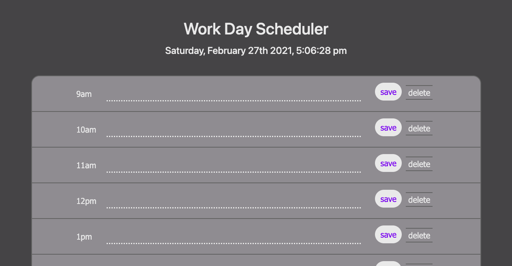
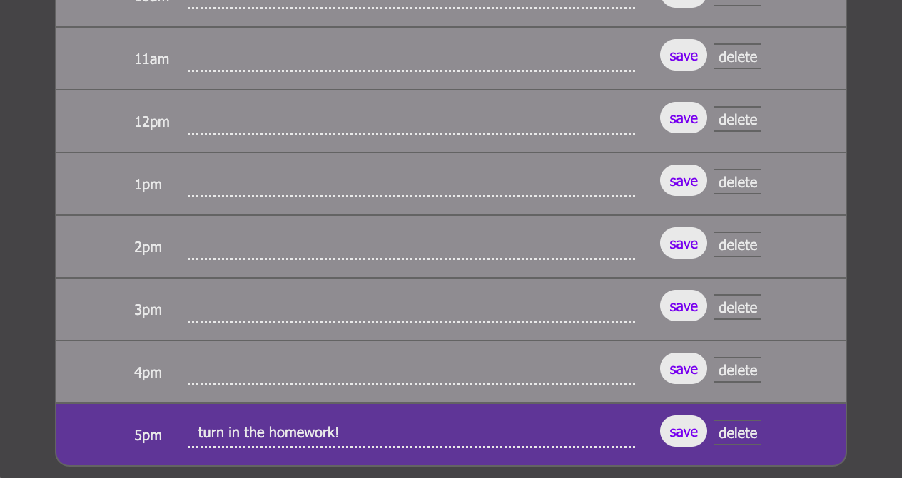
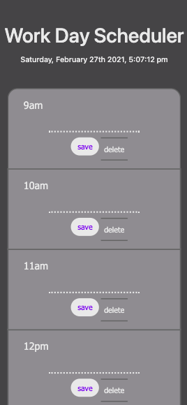

# work-day-scheduler

## Work Day Scheduler
This is a simple hour planner for 9:00am-5:00pm. To use the app, simply click on the dotted line for the intended hour block, enter some text, and click either "save" or "delete" to store or remove the entered text. Saving locally stores entries so that they'll remain when the page is reloaded, and deleting clears any entered text and locally stores an empty string.

## Deployment 
To visit this website, simply follow this [link](https://rflctveq.github.io/work-day-scheduler/) or enter the following into your address bar: https://rflctveq.github.io/work-day-scheduler/. 

## Screenshot
Here's two images of the application being run on a desktop-sized viewport: 

And here's an image of the application being run on a viewport the size of an iPhone X:

## Technologies Used

* Bootstrap 4.6.0

* jQuery 3.5.1 

* Moment.js 2.29.1

* GitHub Pages (host)

## Contact
### Ian Everitt
* Email me: ian.andrew.everitt@gmail.com

## License 

Copyright (c) 2021 Work Day Scheduler

Permission is hereby granted, free of charge, to any person obtaining a copy
of this software and associated documentation files (the "Software"), to deal
in the Software without restriction, including without limitation the rights
to use, copy, modify, merge, publish, distribute, sublicense, and/or sell
copies of the Software, and to permit persons to whom the Software is
furnished to do so, subject to the following conditions:

The above copyright notice and this permission notice shall be included in all
copies or substantial portions of the Software.

THE SOFTWARE IS PROVIDED "AS IS", WITHOUT WARRANTY OF ANY KIND, EXPRESS OR
IMPLIED, INCLUDING BUT NOT LIMITED TO THE WARRANTIES OF MERCHANTABILITY,
FITNESS FOR A PARTICULAR PURPOSE AND NONINFRINGEMENT. IN NO EVENT SHALL THE
AUTHORS OR COPYRIGHT HOLDERS BE LIABLE FOR ANY CLAIM, DAMAGES OR OTHER
LIABILITY, WHETHER IN AN ACTION OF CONTRACT, TORT OR OTHERWISE, ARISING FROM,
OUT OF OR IN CONNECTION WITH THE SOFTWARE OR THE USE OR OTHER DEALINGS IN THE
SOFTWARE.